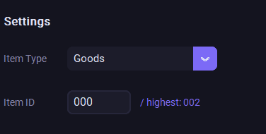
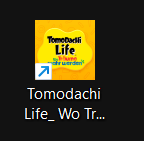
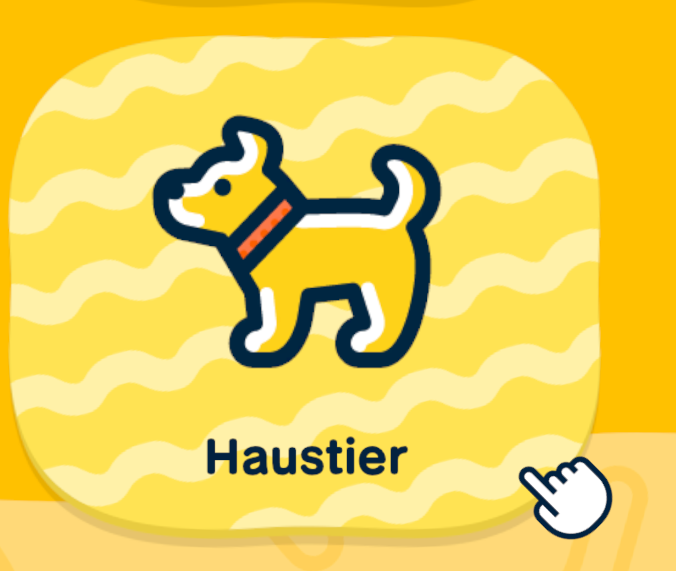
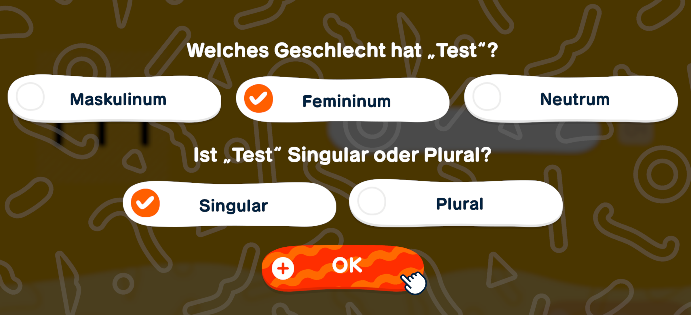
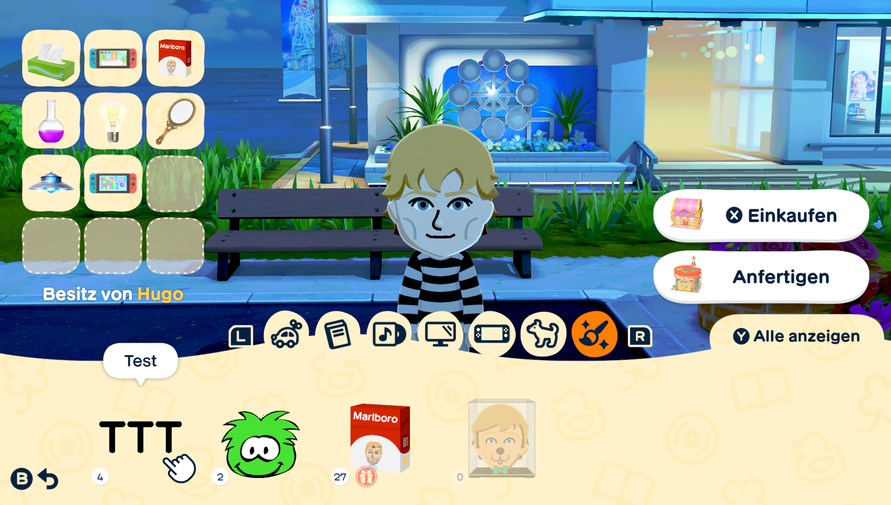
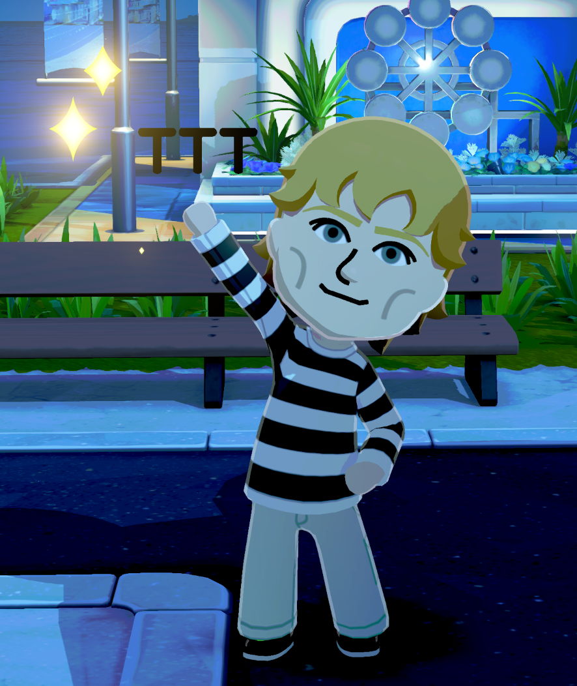
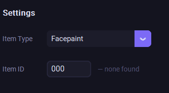

# How to Use — Tomodachi Texture Tool

---

**1.**

**2.**

**3.**

**4.**

**5.**

**6.**

**7.**

**8.**

**9.**

**10.**

**11.**

**12.**

**13.**

**14.**

**15.**

**16.**

**17.**

**18.**

**19.**

**20.**

**21.**

**22.**

**23.**

**24.**

**25.**

**26.**

**27.**

**28.**

**29.**

**30.**

**31.**

